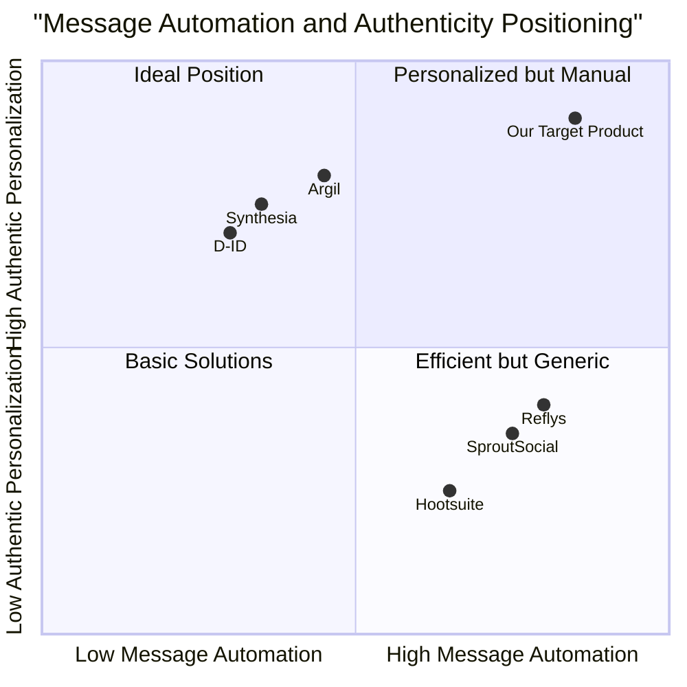

# Product Requirements Document: AI-Driven Avatar for Influencers

## Project Information

- **Project Name:** ai_driven_avatar
- **Programming Language:** React, JavaScript, and Tailwind CSS
- **Original Requirements:** Create an AI-driven avatar that enables influencers to scale interactions with fans by automating message responses across social media platforms. The avatar will be trained on the influencer's content and tone to ensure responses reflect their personality.

## 1. Product Definition

### 1.1 Product Goals

1. **Engagement Scaling**: Enable influencers to automatically respond to messages across platforms, increasing fan engagement without proportionally increasing time commitment
2. **Authentic Representation**: Create AI responses that accurately reflect the influencer's personal tone, language style, and brand voice
3. **Workload Reduction**: Minimize time spent on repetitive interactions while maintaining meaningful connections with audience

### 1.2 User Stories

1. As an influencer with 500K followers, I want my avatar to respond to basic questions about my content so that I can engage with more fans without spending all day on social media
2. As an influencer's manager, I want to review and approve the avatar's automated responses so that we maintain brand safety and message consistency
3. As a content creator, I want to customize my avatar's tone and language style so that my automated responses sound authentically like me
4. As a busy influencer, I want to toggle between automated and manual responses so that I can personally handle more sensitive or complex conversations
5. As a growing creator, I want analytics on my avatar's interactions so that I can understand what my audience is most interested in


### 1.3 Competitive Analysis

| Competitor | Pros | Cons |
|------------|------|------|
| **Synthesia** | - 160+ realistic avatars<br>- Supports 130+ languages<br>- Professional video content creation | - Primarily video-focused<br>- Limited social media integration<br>- Not specifically built for DM automation |
| **D-ID** | - Cartoon-style avatars<br>- ChatGPT integration<br>- 119 language support | - Focus on visual avatars, not text automation<br>- Limited social media platform integration |
| **Reflys** | - Specialized in Instagram DM automation<br>- 24/7 engagement capability<br>- Lead generation features | - Limited to Instagram and Messenger<br>- Less personalized to influencer style<br>- No training on influencer content |
| **SproutSocial** | - Unified social inbox<br>- Multi-platform support<br>- Team collaboration features | - High pricing structure<br>- Not influencer-specific<br>- Generic AI assistance |
| **Hootsuite** | - Comprehensive platform management<br>- Saved replies feature<br>- Analytics capabilities | - Complex interface<br>- Not personalized to influencer voice<br>- Focus on scheduling over interaction |
| **Argil** | - AI influencer creation<br>- Scalable content generation<br>- Customizable personas | - Content creation focus<br>- Less emphasis on message management<br>- Newer to market with less proven results |
| **Our Target Product** | - Trained specifically on influencer content<br>- Focuses on authentic tone matching<br>- Dedicated to message automation<br>- Multi-platform support | - New entrant in the market<br>- Initially limited platform integrations<br>- MVP focuses on text vs. visual content |

### 1.4 Competitive Quadrant Chart



## 2. Technical Specifications

### 2.1 Requirements Analysis

The AI-Driven Avatar system needs to perform three core functions:

1. **Data Training & Learning**: The system must ingest and learn from an influencer's existing content (posts, comments, videos) to understand their communication style, common responses, and personality traits.

2. **Multi-Platform Message Management**: The system must connect to multiple social media platforms, retrieve incoming messages, identify appropriate responses, and post those responses on behalf of the influencer.

3. **Safety & Control**: The system must provide robust controls to prevent inappropriate responses, ensure brand safety, and allow the influencer to maintain oversight of all automated communications.

These core functions are supported by a user interface that allows influencers to set up, monitor, and control their avatar's behavior.


### 2.2 Requirements Pool

#### P0 (Must-Have)

1. **Message Response Automation**
   - System MUST automatically respond to direct messages on supported platforms
   - System MUST mimic the influencer's tone, style, and language patterns
   - Responses MUST be contextually appropriate based on message content

2. **Social Platform Integration**
   - MVP MUST integrate with Instagram DMs
   - MVP MUST integrate with YouTube comments
   - System MUST support OAuth authentication for secure platform access

3. **Data Training Pipeline**
   - System MUST scrape and ingest public posts and comments from the influencer
   - System MUST respect platform terms of service during data collection
   - Data processing MUST maintain privacy compliance

4. **Basic Control Interface**
   - Influencers MUST be able to toggle the avatar on/off
   - System MUST allow manual handling of selected messages
   - Interface MUST show pending, automated, and manually handled messages

5. **Safety Controls**
   - System MUST include default filters for inappropriate language
   - System MUST route potentially sensitive topics (e.g., suicide mentions) to human handlers
   - System MUST allow emergency shutdown of automation

#### P1 (Should-Have)

1. **Analytics Dashboard**
   - System SHOULD track message volume and response times
   - System SHOULD measure engagement metrics for automated interactions
   - Dashboard SHOULD display user satisfaction ratings when available

2. **Moderation Controls**
   - System SHOULD support custom keyword filtering
   - System SHOULD provide category-based message routing
   - System SHOULD allow creation of pre-approved response templates

3. **Subscription Management**
   - System SHOULD support tiered plans (Bronze, Silver, Gold)
   - System SHOULD integrate with Stripe for payment processing
   - System SHOULD enforce message volume limits based on subscription tier

#### P2 (Nice-to-Have)

1. **Advanced Personalization**
   - System MAY allow fine-tuning of specific response categories
   - System MAY support persona adjustments (more casual, more professional, etc.)
   - System MAY learn from manual responses to improve future automated replies

2. **Additional Platform Support**
   - System MAY integrate with Twitter/X direct messages
   - System MAY support Facebook Messenger
   - System MAY support TikTok comments

3. **Advanced Analytics**
   - System MAY provide sentiment analysis of user interactions
   - System MAY generate content suggestions based on common questions
   - System MAY identify trends in user interests and engagement

### 2.3 UI Design Draft

#### Main Dashboard

```
+-----------------------------------------------+
|  LOGO            [Account] [Settings] [Help]  |
+-----------------------------------------------+
|                                               |
|  AVATAR STATUS: [ON/OFF] ▼                     |
|                                               |
+-----------------------------------------------+
|           |                |                  |
| NAVIGATION|    MESSAGE     |     MESSAGE      |
|           |     FEED       |     DETAILS      |
| □ Messages|                |                  |
| □ Settings| - Instagram DM |  From: @user123  |
| □ Analytics| 35 unread     |  Time: 10:45 AM  |
| □ Training|                |                  |
|           | - YouTube      |  "How did you     |
| PLATFORMS | 12 unread      |   start your     |
| ■ Instagram|               |   fitness        |
| ■ YouTube | [Show All]     |   journey?"      |
| □ Twitter |                |                  |
|           |                |  [AI RESPONSE]:  |
|           |                |  "I started      |
| FILTERS   |                |   working out... |
| □ Pending |                |                  |
| □ Auto    |                |  [Override]      |
| □ Manual  |                |  [Edit & Send]   |
|           |                |  [Send As-Is]    |
+-----------------------------------------------+
```

#### Settings Page

```
+-----------------------------------------------+
|  LOGO            [Account] [Settings] [Help]  |
+-----------------------------------------------+
|                                               |
|  SETTINGS                                     |
|                                               |
+-----------------------------------------------+
|           |                                   |
| NAVIGATION|      CONFIGURATION PANEL          |
|           |                                   |
| □ Messages| PERSONALITY SETTINGS              |
| ■ Settings| Tone: [Casual] [Professional] [Fun]|
| □ Analytics|                                  |
| □ Training| Response Style:                   |
|           | [x] Short & Direct                |
| SETTING   | [ ] Detailed & Thorough           |
| CATEGORIES| [ ] Emoji-Heavy                   |
| ■ Avatar  |                                   |
| □ Account | MODERATION RULES                  |
| □ Alerts  | [x] Block offensive language      |
| □ Billing | [x] Route personal questions      |
|           | [ ] Block political topics        |
|           | [+] Add Custom Rule              |
|           |                                   |
|           | NOTIFICATION PREFERENCES          |
|           | [x] Email alerts for exceptions   |
|           | [ ] Daily summary report          |
|           |                                   |
+-----------------------------------------------+
```

#### Analytics Dashboard

```
+-----------------------------------------------+
|  LOGO            [Account] [Settings] [Help]  |
+-----------------------------------------------+
|                                               |
|  ANALYTICS                        [EXPORT]    |
|                                               |
+-----------------------------------------------+
|           |                                   |
| NAVIGATION|      PERFORMANCE METRICS          |
|           |                                   |
| □ Messages|  TOTAL MESSAGES PROCESSED         |
| □ Settings|  ████████████████ 2,345          |
| ■ Analytics|                                 |
| □ Training|  RESPONSE RATE                    |
|           |  ███████████████████ 95%         |
| TIME      |                                   |
| PERIOD    |  AVERAGE RESPONSE TIME            |
| ■ Today   |  ██████████ 2.4 seconds           |
| □ Week    |                                   |
| □ Month   |  PLATFORM BREAKDOWN               |
| □ Custom  |  Instagram: ███████ 65%           |
|           |  YouTube:   ████ 35%              |
|           |                                   |
|           |  MESSAGE CATEGORIES               |
|           |  Product Questions: ████████ 45%  |
|           |  Personal Questions: █████ 25%    |
|           |  Collaboration Requests: ████ 20% |
|           |  Other: ██ 10%                    |
|           |                                   |
+-----------------------------------------------+
```

### 2.4 Open Questions

1. **Content Boundaries**: How should the avatar determine what is within its knowledge sphere and what should be escalated to the human influencer?

2. **Data Freshness**: How frequently should the system re-train on new influencer content to stay current with evolving messaging and topics?

3. **Audience Transparency**: Should the system disclose to audience members that they are interacting with an AI avatar? If so, how and when?

4. **Response Diversity**: How can we ensure responses don't become repetitive while maintaining authenticity to the influencer's voice?

5. **Platform Limitations**: How will the system handle potential rate limiting from social media APIs?

6. **Training Data Scope**: Beyond public posts and comments, what additional data sources might help improve avatar accuracy (e.g., provided voice samples, FAQ documents)?

## 3. Implementation Plan

### 3.1 Technical Architecture

The MVP will be built using the following technologies:

- **Backend**: Node.js with Express for API development
- **Frontend**: React with Tailwind CSS for UI components
- **Database**: MongoDB for user data and interaction history
- **LLM**: OpenAI API with fine-tuning capabilities for personalized responses
- **Social Media Integration**: Meta API (Instagram) and YouTube Data API
- **Hosting**: Replit or similar cloud platform suitable for MVP deployment
- **Authentication**: OAuth 2.0 for secure social media account access
- **Payment Processing**: Stripe API for subscription management

### 3.2 Rollout Timeline

1. **Phase 1 - Development (6 weeks)**
   - Week 1-2: Core backend infrastructure and social media API integrations
   - Week 3-4: LLM integration and training pipeline implementation
   - Week 5-6: Frontend dashboard and control interface development

2. **Phase 2 - Private Beta (4 weeks)**
   - Select 5-10 influencers across different niches
   - Implement feedback collection mechanism
   - Daily monitoring and rapid iterations

3. **Phase 3 - Public Beta (4 weeks)**
   - Expand to 50+ users
   - Implement subscription tiers
   - Refine based on broader usage patterns

4. **Phase 4 - Full Launch**
   - Complete feature set
   - Marketing push
   - Ongoing support and feature enhancement

### 3.3 Success Metrics

1. **User Retention**: >70% of beta users continuing after 4 weeks
2. **Message Volume**: >10,000 messages successfully processed in beta
3. **Response Accuracy**: >90% of automated responses requiring no correction
4. **User Satisfaction**: >4.0/5.0 average rating from influencers
5. **Engagement Lift**: >15% increase in total audience engagement compared to pre-implementation

## 4. Future Roadmap

### 4.1 Version 2.0 Features

1. **Monetization Tools**: Allow avatars to share merchandise links and booking information
2. **Calendar Integration**: Automated appointment scheduling through the avatar
3. **Fan Feedback Loop**: Direct feedback collection on avatar response quality
4. **Multi-language Support**: Expansion to support global influencer audience
5. **Advanced Moderation**: Custom behavior rules and improved content filtering

### 4.2 Long-term Vision

1. **Multi-modal Avatar**: Expansion from text to voice and potentially visual avatar representations
2. **Creator Network Effects**: Enabling cross-promotion between influencer avatars
3. **Platform Expansion**: Supporting emerging social media platforms and formats
4. **Enterprise Features**: Team collaboration tools for agencies managing multiple influencers
5. **Data Insights Platform**: Advanced analytics to drive content strategy beyond message management

## 5. Conclusion

The AI-Driven Avatar for Influencers presents a significant opportunity to solve a critical pain point for content creators: scaling engagement without sacrificing authenticity or consuming unlimited time. By automating routine interactions while maintaining the influencer's unique voice and style, this product can help creators focus on high-value content production while still nurturing their audience relationships.

The MVP approach outlined in this PRD allows for rapid validation of core concepts while establishing a foundation for future feature expansion. Success will be measured primarily through user retention, message processing efficiency, and measurable engagement improvements for participating influencers.

---

**Document Version**: 1.0  
**Last Updated**: 2024-05-12  
**Author**: Emma, Product Manager
