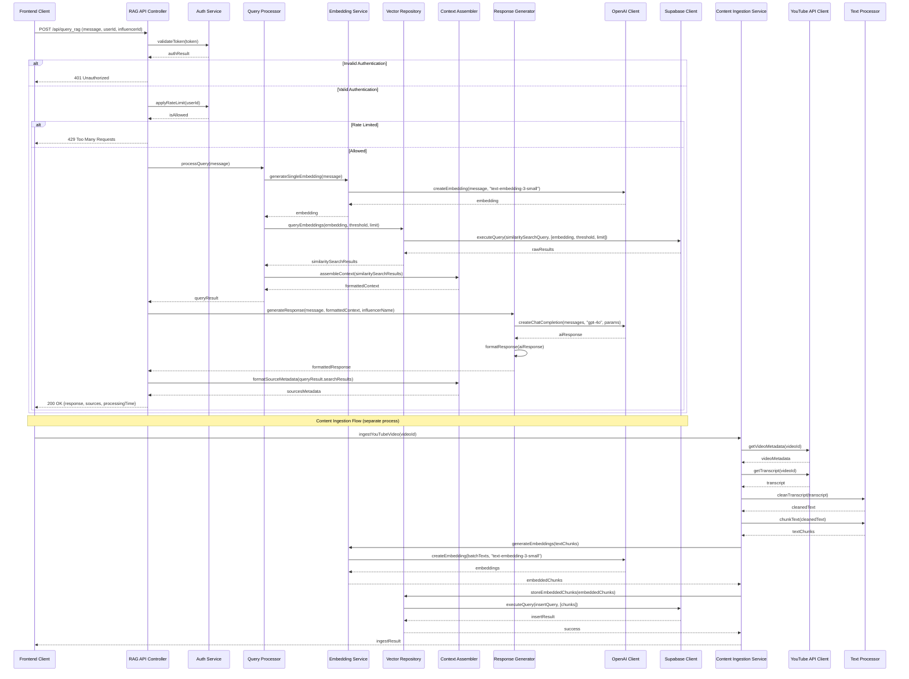
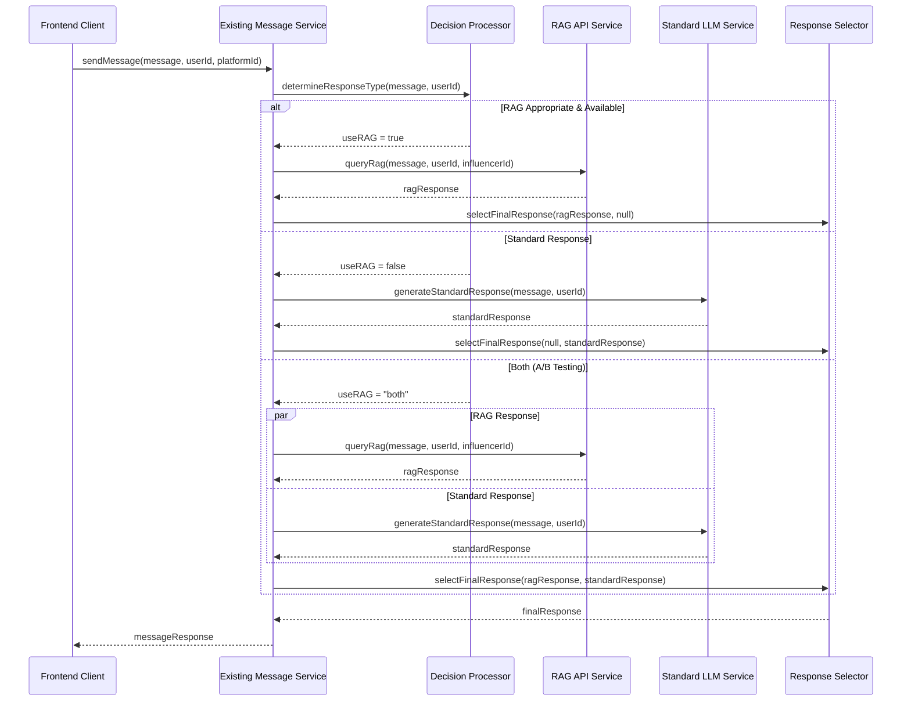
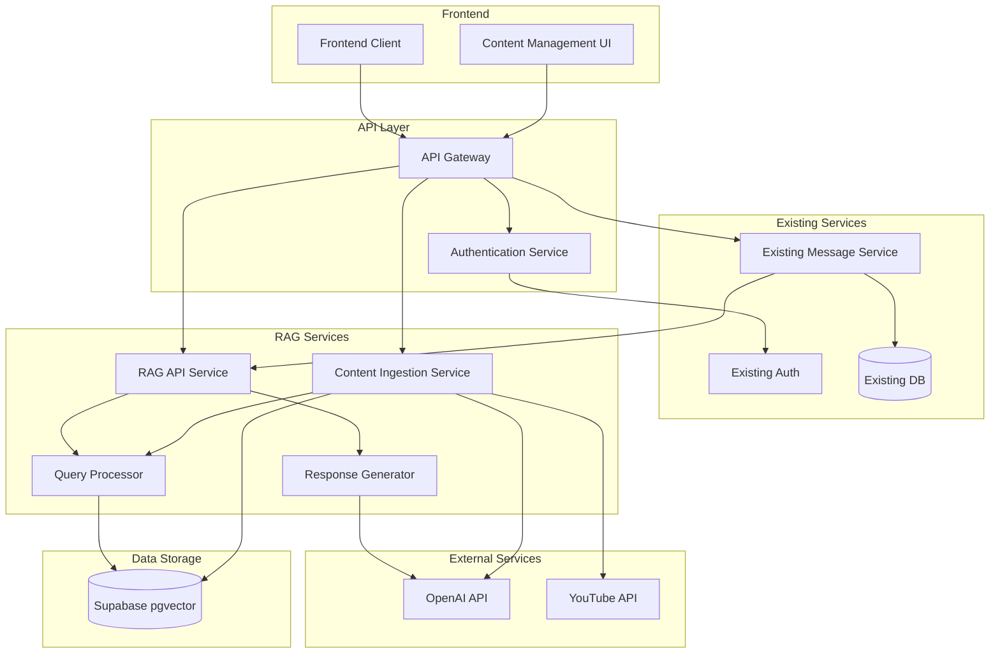

# RAG Pipeline Architecture for AI-Driven Avatar App

## Implementation approach

Based on the technical specification, we will implement a Retrieval-Augmented Generation (RAG) pipeline to enhance the existing AI-Driven Avatar App with contextual knowledge from influencer content. The architecture will focus on effectively integrating Supabase with pgvector extension for vector storage and GPT-4o for generating contextual responses.

The implementation will use the following key technologies and frameworks:

1. **Backend Framework**: Node.js with Express.js for API development
2. **Vector Database**: Supabase with pgvector extension for efficient similarity searches
3. **Embedding Generation**: OpenAI's text-embedding-3-small model
4. **LLM for Response Generation**: OpenAI's GPT-4o model
5. **Content Processing**: Custom pipeline for YouTube transcript processing
6. **Authentication**: JWT-based authentication for secure API access
7. **Deployment**: Docker containers for consistent environments

The architecture will be designed for modularity, allowing components to be developed, tested, and scaled independently. We'll focus on minimizing latency while providing high-quality, contextually relevant responses.

## Data structures and interfaces

```mermaid
classDiagram
    class ContentIngestionService {
        -youtubeApiClient: YouTubeApiClient
        -textProcessor: TextProcessor
        -embeddingService: EmbeddingService
        -vectorRepository: VectorRepository
        +ingestYouTubeVideo(videoId: string): Promise~boolean~
        +ingestYouTubeChannel(channelId: string): Promise~boolean~
        +processTranscript(transcript: string): Promise~ChunkResult~
        +scheduleContentRefresh(): void
    }

    class YouTubeApiClient {
        -apiKey: string
        +getTranscript(videoId: string): Promise~string~
        +getChannelVideos(channelId: string): Promise~VideoMetadata[]~
        +getVideoMetadata(videoId: string): Promise~VideoMetadata~
    }

    class TextProcessor {
        -chunkSize: number
        -overlapSize: number
        +chunkText(text: string): TextChunk[]
        +cleanTranscript(transcript: string): string
        +normalizeText(text: string): string
    }

    class EmbeddingService {
        -openaiClient: OpenAIClient
        -embeddingModel: string
        +generateEmbeddings(textChunks: TextChunk[]): Promise~EmbeddedChunk[]~
        +generateSingleEmbedding(text: string): Promise~number[]~
        +batchProcess(chunks: TextChunk[], batchSize: number): Promise~EmbeddedChunk[]~
    }

    class VectorRepository {
        -supabaseClient: SupabaseClient
        +storeEmbeddedChunks(chunks: EmbeddedChunk[]): Promise~boolean~
        +queryEmbeddings(embedding: number[], threshold: number, limit: number): Promise~SimilaritySearchResult[]~
        +deleteContentBySource(sourceId: string): Promise~boolean~
        +updateContentMetadata(id: string, metadata: JSON): Promise~boolean~
    }

    class QueryProcessor {
        -embeddingService: EmbeddingService
        -vectorRepository: VectorRepository
        -contextAssembler: ContextAssembler
        +processQuery(message: string): Promise~QueryResult~
        +findRelevantContext(embedding: number[]): Promise~SimilaritySearchResult[]~
    }

    class ContextAssembler {
        -maxContextTokens: number
        +assembleContext(searchResults: SimilaritySearchResult[]): string
        +formatSourceMetadata(searchResults: SimilaritySearchResult[]): SourceMetadata[]
        +truncateContext(context: string): string
    }

    class ResponseGenerator {
        -openaiClient: OpenAIClient
        -modelName: string
        -systemPromptTemplate: string
        +generateResponse(message: string, context: string, influencerName: string): Promise~AIResponse~
        +formatResponse(rawResponse: string): string
        +configureModelParameters(params: ModelParams): void
    }

    class OpenAIClient {
        -apiKey: string
        +createEmbedding(text: string, model: string): Promise~number[]~
        +createChatCompletion(messages: Message[], model: string, params: ModelParams): Promise~AIResponse~
    }

    class SupabaseClient {
        -url: string
        -key: string
        +executeQuery(query: string, params: any[]): Promise~any~
        +connect(): void
        +disconnect(): void
    }

    class RagApiController {
        -queryProcessor: QueryProcessor
        -responseGenerator: ResponseGenerator
        -authService: AuthService
        +queryRag(req: Request, res: Response): Promise~void~
        +validateRequest(req: Request): boolean
        +handleError(error: Error, res: Response): void
    }

    class AuthService {
        -jwtSecret: string
        +validateToken(token: string): Promise~AuthResult~
        +generateToken(userId: string, permissions: string[]): string
        +applyRateLimit(userId: string): boolean
    }

    class ContentManager {
        -contentIngestionService: ContentIngestionService
        -vectorRepository: VectorRepository
        +addContent(content: ContentData): Promise~boolean~
        +removeContent(contentId: string): Promise~boolean~
        +listContent(influencerId: string): Promise~ContentMetadata[]~
        +refreshContent(contentId: string): Promise~boolean~
    }

    class SystemIntegration {
        -ragApiController: RagApiController
        -existingMessageProcessor: ExistingMessageProcessor
        +initialize(): void
        +setupRoutes(app: Express): void
        +configureFallbacks(): void
    }

    class DataTypes {
        <<interface>>
        TextChunk
        EmbeddedChunk
        SimilaritySearchResult
        QueryResult
        AIResponse
        VideoMetadata
        SourceMetadata
        ModelParams
        Message
        AuthResult
        ContentData
        ContentMetadata
        ChunkResult
    }

    ContentIngestionService --> YouTubeApiClient
    ContentIngestionService --> TextProcessor
    ContentIngestionService --> EmbeddingService
    ContentIngestionService --> VectorRepository
    QueryProcessor --> EmbeddingService
    QueryProcessor --> VectorRepository
    QueryProcessor --> ContextAssembler
    ResponseGenerator --> OpenAIClient
    VectorRepository --> SupabaseClient
    EmbeddingService --> OpenAIClient
    RagApiController --> QueryProcessor
    RagApiController --> ResponseGenerator
    RagApiController --> AuthService
    ContentManager --> ContentIngestionService
    ContentManager --> VectorRepository
    SystemIntegration --> RagApiController
```



## Program call flow



## API Design

### 1. Query RAG API

**Endpoint:** `POST /api/query_rag`

**Request:**
```json
{
  "message": "What did the influencer say about sustainable fashion?",
  "userId": "user_123",
  "influencerId": "inf_456",
  "conversationId": "conv_789" // Optional
}
```

**Response:**
```json
{
  "response": "In my recent video 'Sustainable Fashion Trends 2023', I mentioned that fast fashion contributes to significant environmental issues. I recommended looking for brands that use recycled materials and have transparent supply chains. I also shared some of my favorite sustainable clothing brands including Reformation, Patagonia, and ThredUp for second-hand shopping.",
  "sources": [
    {
      "title": "Sustainable Fashion Trends 2023",
      "url": "https://youtube.com/watch?v=abc123",
      "relevanceScore": 0.92
    },
    {
      "title": "My Eco-friendly Morning Routine",
      "url": "https://youtube.com/watch?v=def456",
      "relevanceScore": 0.78
    }
  ],
  "processingTime": 1.25
}
```

**Status Codes:**
- 200 OK - Successful response
- 400 Bad Request - Invalid request format
- 401 Unauthorized - Authentication failure
- 429 Too Many Requests - Rate limit exceeded
- 500 Internal Server Error - Server-side error

### 2. Content Ingestion API

**Endpoint:** `POST /api/ingest_content`

**Request:**
```json
{
  "sourceType": "youtube",
  "sourceId": "videoId_xyz",
  "influencerId": "inf_456",
  "metadata": {
    "title": "Optional title override",
    "tags": ["fashion", "sustainable"]
  }
}
```

**Response:**
```json
{
  "success": true,
  "contentId": "cont_abc123",
  "chunkCount": 15,
  "processingTime": 3.45
}
```

**Status Codes:**
- 200 OK - Successful ingestion
- 400 Bad Request - Invalid source ID or format
- 401 Unauthorized - Authentication failure
- 500 Internal Server Error - Processing failure

### 3. Content Management API

**Endpoint:** `GET /api/content/{influencerId}`

**Response:**
```json
{
  "contents": [
    {
      "contentId": "cont_abc123",
      "sourceType": "youtube",
      "sourceId": "videoId_xyz",
      "title": "Sustainable Fashion Trends 2023",
      "url": "https://youtube.com/watch?v=abc123",
      "chunkCount": 15,
      "createdAt": "2023-05-01T10:30:00Z",
      "updatedAt": "2023-05-01T10:30:00Z"
    },
    {
      "contentId": "cont_def456",
      "sourceType": "youtube",
      "sourceId": "videoId_abc",
      "title": "My Eco-friendly Morning Routine",
      "url": "https://youtube.com/watch?v=def456",
      "chunkCount": 8,
      "createdAt": "2023-04-15T14:22:00Z",
      "updatedAt": "2023-04-15T14:22:00Z"
    }
  ],
  "totalCount": 2
}
```

## Integration with Existing Avatar App

### Frontend Integration

The existing Avatar App frontend will be enhanced with the following integration points:

1. **Message Component Enhancement**:
   - Update the ChatMessage component to display source information when available
   - Add a toggle for users to enable/disable RAG-enhanced responses
   - Include a loading state for RAG queries which may take longer than standard responses

2. **Content Management UI**:
   - Add a new section to the influencer dashboard for managing indexed content
   - Create interfaces for content ingestion, viewing, and refreshing
   - Implement analytics showing which content is most frequently referenced

3. **User Preference Settings**:
   - Allow users to set preferences for response style (more concise vs. detailed)
   - Enable feedback mechanisms for RAG response quality

### Backend Integration

1. **Message Processing Pipeline**:
   - Extend the existing pipeline to incorporate RAG responses
   - Implement a decision layer to determine when to use RAG vs. standard responses
   - Add conversation context tracking for multi-turn interactions



2. **Database Extensions**:
   - Create new tables for conversation history with RAG context
   - Add metadata fields to track which sources were used in responses
   - Implement analytics storage for response quality measurement

3. **Service Integration**:
   - Add health checks for the RAG service
   - Implement circuit breakers for graceful degradation
   - Create monitoring endpoints for operational visibility

### System Configuration

1. **Environment Variables**:
```
# Existing App Variables
EXISTING_APP_DB_URL=...
EXISTING_APP_PORT=...

# New RAG Variables
SUPABASE_URL=...
SUPABASE_KEY=...
OPENAI_API_KEY=...
YOUTUBE_API_KEY=...
RAG_ENABLED=true
EMBEDDING_MODEL=text-embedding-3-small
LLM_MODEL=gpt-4o
VECTOR_MATCH_THRESHOLD=0.75
VECTOR_MATCH_COUNT=3
```

2. **Feature Flags**:
   - `enable_rag`: Master toggle for RAG functionality
   - `show_sources`: Control whether to show source information to end-users
   - `use_conversation_context`: Include previous turns in context
   - `enable_content_management_ui`: Toggle content management interface

## Deployment Architecture



## Scaling & Performance Considerations

1. **Vector Database Scaling**:
   - Implement connection pooling for Supabase
   - Consider IVFFlat indexes for faster similarity search at scale
   - Monitor query performance and adjust index parameters as content grows

2. **Embedding Generation Optimization**:
   - Implement caching for frequently embedded queries
   - Use batch processing for efficient API usage
   - Consider edge deployment for lower latency

3. **Response Generation**:
   - Implement streaming responses for better user experience
   - Cache common responses with TTL (Time to Live)
   - Optimize prompt design for faster generation

4. **Content Ingestion**:
   - Use worker queues for asynchronous processing
   - Implement backoff strategies for API rate limits
   - Schedule bulk operations during off-peak hours

## Monitoring & Observability

1. **Key Metrics**:
   - Response latency (end-to-end and component-level)
   - Vector search performance
   - Embedding generation time
   - Cache hit/miss rates
   - Error rates by component

2. **Logging Strategy**:
   - Structured logging with consistent fields
   - Log sampling for high-volume components
   - Correlation IDs for request tracing
   - PII (Personally Identifiable Information) filtering

3. **Alerting**:
   - Service availability alerts
   - Latency threshold violations
   - Error rate spikes
   - Authentication failures
   - API rate limit warnings

## Anything UNCLEAR

1. **Existing Avatar App Database Schema**: The detailed schema of the existing app's database is not fully specified. Integration will require a clear understanding of the current data model, especially for user profiles and conversation history.

2. **Instagram Integration**: The technical specification focuses on YouTube content, but the existing app has Instagram integration. We should clarify how Instagram content (posts, stories, comments) should be included in the RAG pipeline.

3. **Performance Requirements**: While some performance targets are mentioned, more specific SLAs for the integrated system would help guide implementation decisions, especially for response time expectations.

4. **User Segmentation**: The current specification doesn't address if different user types should receive different levels of RAG service (e.g., premium vs. free users).

5. **Content Permissions**: Further clarification on how to handle private or unlisted YouTube videos in the content ingestion pipeline would be beneficial.